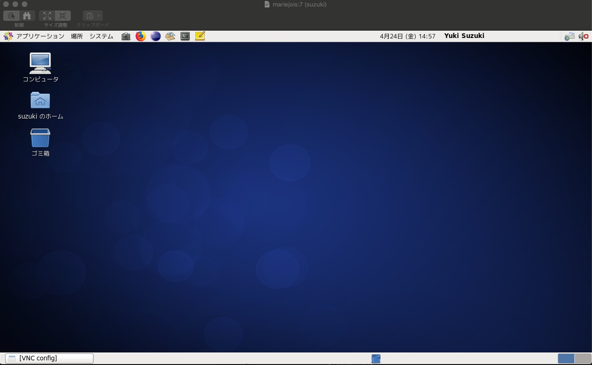

# 本日の実習内容
1. 画面共有の環境設定
2. DSMを用いた理論波形計算
3. 計算結果(SPCファイル)をSAC形式へ変換（SACは時系列データ特に地震波形のプロット・解析のためのツール）

# 実習
[Skype会議](https://join.skype.com/YsHD0ReeJ1xa)15:00~18:20

## 1. 画面共有設定
- waveは学内ネットワークにアクセスするための踏み台サーバ、ajilloは高速計算サーバ
- 画面共有のためのサーバmariejoisにアカウント作成（済み &rarr; pw変更）
- VNC server起動（**ポート番号注意**）
  `vncserver -geometry 800x600 :"port number"`
- ローカルから以下のコマンドで再ログイン
  `ssh -L 5901:'hostname':5907 'username'@wave.eps.s.u-tokyo.ac.jp`
- この場合、'5901'はローカルマシンのポート番号、'hostname'は共有したいマシンの名前. '5907'はそのマシンで画面共有のために開いているポートの番号。
- ローカルマシンがwindowsの場合VNCviewer等のソフトウェアが必要. VNCserver欄に'localhost:5901'等と入力してConnect
- Macの場合はFinderからサーバへ接続. サーバアドレスはvnc://localhost:5901等
- 成功すると以下のような画面が表示される


---
---

## 2. 理論波形計算
### 2.1 DSMインプットファイルの中身
- tlen: 地震波形の時間長
- np: Number of points
- 構造の情報は、ある半径区間において多項式形式で表される.
- 例えばある半径$r$での密度$\rho$は以下のように表される。
  $\rho(r/R) = a + b*(r/R)^1 + c*(r/R)^2 + d*(r/R)^3$
  ここで$R$は地球半径で$R=6371$.
- SHとPSVでは構造layerの数等が異なるので注意.
- 震源パラメータは、震源重心位置の半径と緯度、経度、モーメントテンソル解
- nr: 観測点の数
- 観測点パラメータ緯度、経度の順
- 出力ファイルリスト


### 2.2 DSM実行
- MPI（並列計算）実行
``mpirun -n 4 mpi-tish < MIASP_SH.inf``
ここでは/mnt/lasagna/suzuki/Ensyu2020/structure/MIASP_SH.inf
/mnt/lasagna/suzuki/Ensyu2020/structure/MIASP_PSV.infを用いる.
**実習終了後に上のサンプルファイルをtlen=3276.8, np=1024に変更しました. また出力ファイル名も変更しました. 実習中に計算してもらった出力ファイル名では、kibraryの仕様の関係でSPC_SACが実行できない可能性があったので. TAが試したところ4並列(-n 4)で実行してせいぜい5分くらいで終わると思います. 時間があれば試してみてください.**


### 2.3 計算結果(\*.spcファイル)を時系SAC形式(\*.[R,T,Z]s)に変換
- 演習ではTAが用意したサンプル(/mnt/lasagna/suzuki/Ensyu2020/samplespc)で試しました.

#### (i) 事前準備
  1. [Kibray](https://github.com/kensuke1984/Kibrary)からkibraryをインストール.
  2. .bash_profileに以下のおまじないを貼り付ける.
```
export PATH=/home/???/Kibrary/bin:$PATH
export CLASSPATH=/home/???/Kibrary/bin/kibrary-0.4.8.jar:$CLASSPATH
```

#### (ii) \*.spcの変換
1. SPC_SACを実行する.
```
kibrary_property #実行するとリストが表示されるのでSPC_SAC(14)を選択
kibrary_operation io.github.kensuke1984.kibrary.util.spc.SPC_SAC20200424171111.properties
```
2. 今回はSPC_SAC.propertiesの中身は編集しませんでしたが、次回中身を説明して編集してみます.

#### (iii) SACの使い方
1. 以下の内容を.bash_profileに書き加える.

```
export SACHOME="/usr/local/sac"
export SACAUX="${SACHOME}/aux"
export PATH=${SACHOME}/bin:$PATH
```
保存して`source ~/.nash_profile`を実行.

2. SACを起動して波形ファイルを読み込み、プロットしてみる.
```
sac #SACを起動
SAC> read ABC.201506231218A.Zs
SAC> plot
```

---
---


## 課題
**\*興味がある人、時間がある人は以下のことを次回までに試してみてください. 課題0は上で言及したサンプルファイルをTAが修正したもので"2.2 DSM実行"を行うものです.**

0. /mnt/lasagna/suzuki/Ensyu2020/DSMrun/twoStationsを作業フォルダにコピーして、twoStations/201506231218Aに移動してください. そこで`mpirun`を実行.

1. 課題1で用いたインプットファイル（\*\_SH.inf/\*\_PSV.inf）の観測点位置や震源半径（それ以外のパラメータは変更しない）を変更して計算してみる. その際に、同じ場所で計算を実行すると上書きされるので、別の場所に同様のディレクトリ構造を用意して計算を行うことに注意. その後、SPC\_SACでSAC形式に変換しSACでプロットして波形を見てみてください.
その際、以下のSACコマンドを試してみてください. 出力ファイルの出力先フォルダMISAPを作成するのを忘れないようにしてください.
```
SAC> read 'SACファイル'
SAC> plot
SAC> xlim 100 1000 #x軸(時間軸)の範囲の設定
SAC> xlim off #時間軸範囲設定のoff
SAC> ylim -1e-8 1e-8 #y軸(振幅軸)の範囲の設定
SAC> ylim off #振幅範囲設定のoff
SAC> read 'SACファイル1' 'SACファイル2' #2つのSACファイルを同時に読み込み
SAC> plot1 #2つの波形を並べて表示
SAC> plot2 #2つの波形を重ねて表示
```

2. /mnt/lasagna/suzuki/Ensyu2020/DSMrun/manyStationsをコピーしてDSMを実行してみてください. このディレクトリの直下に201506231218Aのディレクトリがあります. 計算を行うときは、201506231218Aに移動して実行してください.  出力先のディレクトリ(MIASP)も用意しているので、その中に出力されると思います. 出力された*.spcはSPC_SACでSAC形式に変換.
